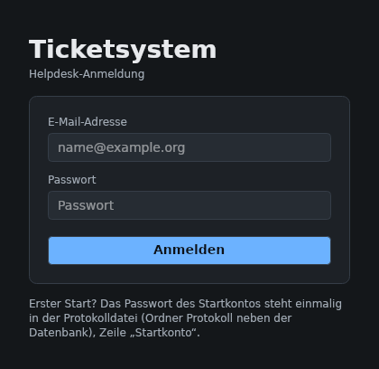
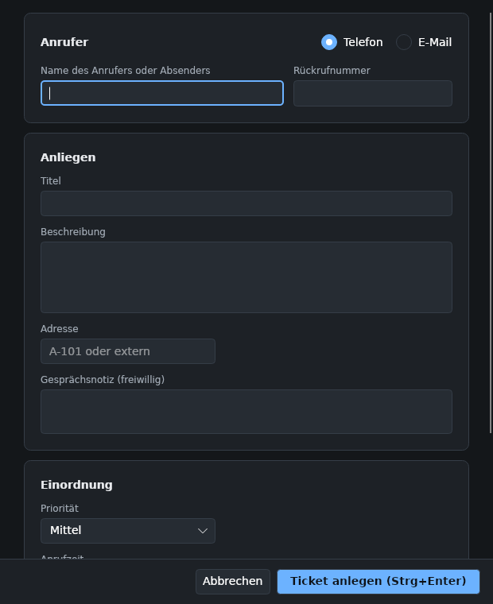
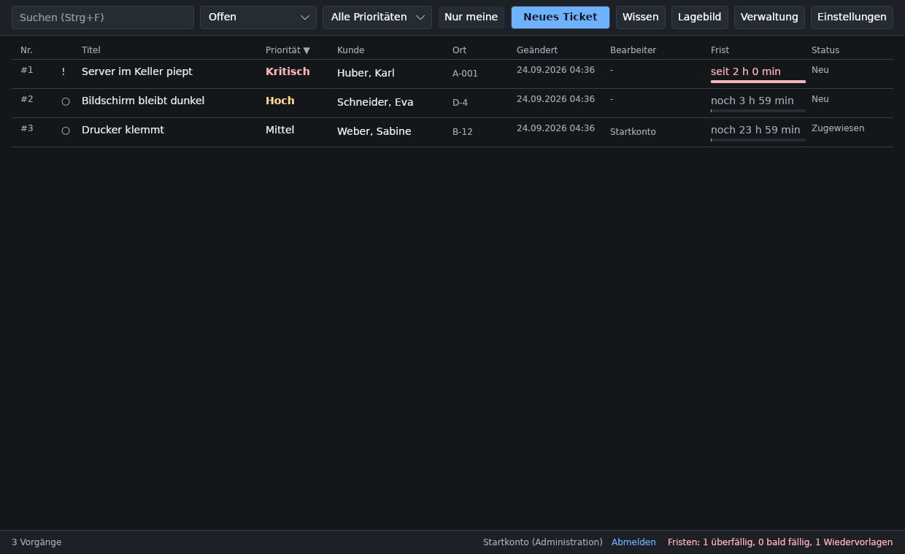
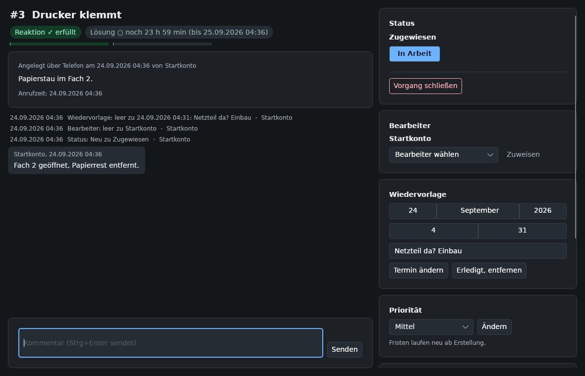

# Einstieg: vom ersten Anmelden bis zum geschlossenen Vorgang

Diese Anleitung richtet sich an neue Mitarbeiterinnen und Mitarbeiter des Helpdesks, die noch nie mit einem Ticketsystem gearbeitet haben. Sie führen darin einen Anruf von der Aufnahme bis zum Abschluss durch das System. Danach kennen Sie die drei Fenster, mit denen Sie täglich arbeiten, und wissen, was ein Vorgang, ein Status und eine Frist sind. Für einzelne Aufgaben im Alltag lesen Sie danach die [Anleitungen für Bearbeiter](bearbeiter.md).

Sie brauchen dafür ein Konto (E-Mail-Adresse und Passwort), das Ihnen die Administration gegeben hat, und etwa zwanzig Minuten.

## Wozu ein Ticketsystem

Ohne System notieren Sie einen Anruf auf einem Zettel. Ruft dieselbe Person eine Stunde später bei einem Kollegen an, weiß der nicht, ob schon jemand daran arbeitet. Fragt die Leitung am Nachmittag, wie viele Anfragen offen sind, kann es niemand sagen. Und ruft die Person drei Wochen später wieder an, erinnert sich niemand, was beim letzten Mal geholfen hat.

Ein Ticketsystem macht aus jeder Anfrage einen **Vorgang** mit einer Nummer. An dieser Nummer hängt alles: wer angerufen hat, was das Problem ist, wer sich kümmert, wie dringend es ist, bis wann es erledigt sein soll und was bisher passiert ist. Statt Zetteln gibt es eine Liste, und alle im Team sehen denselben Stand. Andere Systeme nennen einen Vorgang „Ticket"; das Programm benutzt beide Wörter.

Drei Begriffe brauchen Sie sofort:

- Der **Status** sagt, wo ein Vorgang steht. Er beginnt als **Neu**, wird **Zugewiesen**, sobald jemand ihn übernimmt, dann **In Arbeit**, **Gelöst** und am Ende **Geschlossen**.
- Die **Priorität** sagt, wie dringend er ist: **Niedrig**, **Mittel**, **Hoch** oder **Kritisch**.
- Die **Frist** sagt, bis wann etwas passieren muss. Jeder Vorgang hat zwei: eine für die erste Reaktion und eine für die Lösung. Die Priorität legt beide fest, und das Programm zeigt, wie viel Zeit noch bleibt.

## Schritt 1: Anmelden

1. Starten Sie das Ticketsystem. Das Anmeldefenster erscheint.

   

2. Tragen Sie unter **E-Mail-Adresse** und **Passwort** die Angaben ein, die Sie von der Administration bekommen haben, und klicken Sie auf **Anmelden**. Das Hauptfenster mit der Vorgangsliste öffnet sich. Wenn Sie Teamleitung oder Administration sind, liegt zuerst das Fenster **Lagebild** darüber; schließen Sie es mit Escape.

Nach mehreren falschen Passwörtern ist das Konto eine Weile gesperrt; die Zahlen stehen unter [Konten und Passwörter](referenz.md#konten-und-passwörter). Ein vergessenes Passwort setzt die Administration neu; einen Knopf dafür gibt es nicht.

## Schritt 2: Passwort und Anzeigename

1. Klicken Sie oben rechts auf **Einstellungen**. Das Fenster **Einstellungen** öffnet sich.
2. Tragen Sie unter **Passwort ändern** Ihr bisheriges Passwort, ein neues und dessen Wiederholung ein und klicken Sie auf **Ändern**. Erfüllt das neue Passwort die Regeln nicht (siehe [Konten und Passwörter](referenz.md#konten-und-passwörter)), sagt das Fenster, was fehlt. Sonst meldet es den Erfolg.
3. Tragen Sie unter **Anzeigename** ein, wie Ihr Name auf dem Bildschirm erscheinen soll, zum Beispiel Ihren Vornamen, und klicken Sie auf **Anzeigename speichern**. Der Anzeigename muss im Team eindeutig sein.
4. Schließen Sie das Fenster mit Escape. Unten rechts im Hauptfenster steht Ihr Anzeigename ab der nächsten Anmeldung; bis dahin steht dort noch der alte Name.

Gespeichert wird in jeder Historie Ihr voller Name (Nachname, Vorname), den die Administration setzt; angezeigt wird überall Ihr Anzeigename. Ändern Sie ihn, zeigen auch alte Einträge den neuen Anzeigenamen; gespeichert bleibt darunter Ihr voller Name.

## Schritt 3: Einen Anruf erfassen

Angenommen, Frau Weber ruft an: Der Drucker in Raum B-12 klemmt.

1. Klicken Sie im Hauptfenster auf **Neues Ticket** oder drücken Sie Strg+N. Das Erfassungsfenster öffnet sich mit der Quelle **Telefon**; der Cursor steht im Namensfeld.

   

2. Tragen Sie unter **Name des Anrufers oder Absenders** den Namen als „Nachname, Vorname" ein: `Weber, Sabine`. Hat die Person schon einmal angerufen, erscheint unter dem Feld eine Zeile „Bekannt:" mit ihrer Rufnummer und ihrem Raum; ein Klick auf einen Wert übernimmt ihn.
3. Tragen Sie unter **Rückrufnummer** die Nummer ein, unter der Sie zurückrufen können, zum Beispiel `0221 123456`. Leerzeichen sind erlaubt.
4. Tragen Sie unter **Titel** einen kurzen Satz ein, wie er in der Liste stehen soll: `Drucker klemmt`.
5. Beschreiben Sie unter **Beschreibung**, was gemeldet wurde: `Papierstau im Fach 2, Drucker meldet Fehler und druckt nicht mehr.`
6. Tragen Sie unter **Adresse** den Raum ein: `B-12`. Gültig sind Gebäudebuchstabe, Bindestrich und Raumnummer oder das Wort `extern`.
7. Lassen Sie die **Priorität** auf **Mittel**. Die Bedeutung der Prioritäten steht in der [Referenz](referenz.md#prioritäten-und-fristen).
8. Setzen Sie das Häkchen bei **Mir zuweisen**, wenn Sie den Vorgang selbst bearbeiten wollen.
9. Klicken Sie auf **Ticket anlegen (Strg+Enter)** oder drücken Sie Strg+Enter. Das Fenster schließt sich, unten links im Hauptfenster steht „Ticket #1 wurde angelegt", und der neue Vorgang ist in der Liste markiert.

Wollen Sie abbrechen, drücken Sie Escape oder klicken Sie auf **Abbrechen**. Das Programm merkt sich Ihre Eingaben und fragt beim nächsten Öffnen mit **Weiter bearbeiten** oder **Neu beginnen**.

Fehlt eine Pflichtangabe oder stimmt ein Format nicht, bleibt das Fenster offen, unten steht die Begründung, und der Cursor springt in das betroffene Feld.

## Schritt 4: Die Liste lesen

Jede Zeile ist ein Vorgang: Nummer, ein Zeichen für die Frist, Titel, Priorität, Kunde, Ort, letzte Änderung, Bearbeiter, Frist und Status. Die Frist steht als Restzeit, etwa „noch 7 h 59 min", darunter ein dünner Balken, der sich füllt, je mehr Zeit verstrichen ist.

Unten links steht, wie viele Vorgänge die Liste zeigt und wie viele es gibt, zum Beispiel „1 Vorgang". Rechts stehen Ihr Name, der Knopf **Abmelden** und der Fristenstand.

## Schritt 5: Den Vorgang bearbeiten

1. Öffnen Sie den Vorgang mit einem Doppelklick auf die Zeile oder mit Enter. Das Detailfenster öffnet sich: links der Vorgang mit seiner Historie, rechts die Karten **Status**, **Bearbeiter**, **Wiedervorlage**, **Priorität**, **Anrufer** und **Wissensdatenbank**; die letzte brauchen Sie heute nicht.

   

2. Haben Sie in Schritt 3 das Häkchen **Mir zuweisen** nicht gesetzt, klicken Sie in der Karte **Bearbeiter** auf **Mir zuweisen**. Sind Sie Teamleitung oder Administration, fehlt dieser Knopf: Wählen Sie in derselben Karte unter **Bearbeiter wählen** Ihren Namen und klicken Sie auf **Zuweisen**. Die Karte zeigt Ihren Namen, der Status wechselt auf **Zugewiesen**, und in der Historie erscheint die Zeile „Bearbeiter: leer zu Ihr Name".
3. Klicken Sie in der Karte **Status** auf **In Arbeit**. Der Status wechselt. Dieser Knopf war hervorgehoben, weil er der nächste Schritt war; jetzt ist es **Gelöst**.
4. Rufen Sie Frau Weber zurück und beheben Sie den Papierstau. Schreiben Sie unten links in das Kommentarfeld, was Sie getan haben, zum Beispiel `Fach 2 geöffnet, Papierrest entfernt, Testseite gedruckt.`, und drücken Sie Strg+Enter. Der Kommentar erscheint im Verlauf mit Ihrem Namen und der Uhrzeit. Kommentare sind für das Team gedacht und lassen sich später nicht ändern.
5. Tragen Sie in der Karte **Status** unter **Lösung (wird beim Setzen auf Gelöst als Kommentar gespeichert)** in einem Satz ein, was das Problem gelöst hat, und klicken Sie auf **Gelöst**. Der Status wechselt auf **Gelöst**, und der Lösungstext steht als Kommentar „Lösung: …" im Verlauf.

## Schritt 6: Den Vorgang schließen

Ein gelöster Vorgang wartet auf die Rückmeldung des Kunden. Meldet sich niemand, oder bestätigt Frau Weber, dass der Drucker läuft, schließen Sie ihn.

1. Klicken Sie in der Karte **Status** auf **Vorgang schließen**. Der Knopf fragt nach, denn Geschlossen ist endgültig.
2. Bestätigen Sie mit **Endgültig schließen**. Der Status wechselt auf **Geschlossen**, die Knöpfe in den Karten rechts verschwinden, oben rechts steht der Hinweis, dass der Vorgang geschlossen ist, und der Vorgang nimmt keine Änderungen mehr an.
3. Schließen Sie das Detailfenster mit Escape. In der Liste steht der Vorgang jetzt nicht mehr unter **Offen**; Sie finden ihn über die Ansicht **Alle** oder **Geschlossen**.

Meldet sich Frau Weber später wegen desselben Druckers, legen Sie einen neuen Vorgang an und tragen Sie unter **Verweis auf Ticketnummer (freiwillig)** die alte Nummer ein. Der Verweis wird gespeichert, im Vorgang aber bisher nicht angezeigt; die früheren Vorgänge einer Person finden Sie über den Klick auf ihren Namen in der Liste.

## Schritt 7: Abmelden

Klicken Sie unten rechts auf **Abmelden**, wenn Sie den Platz verlassen. Sonst arbeitet die nächste Person unter Ihrem Namen, und in der Historie stehen Sie als handelnde Person. Das Programm bleibt offen und zeigt wieder das Anmeldefenster.

## Wie es weitergeht

Sie haben jetzt einen Vorgang angelegt, übernommen, bearbeitet, gelöst und geschlossen. Alles Weitere sind Varianten davon:

- Was Sie im Alltag sonst brauchen (E-Mails erfassen, Wiedervorlage, Angaben nachtragen, Wissensdatenbank, Einstellungen): [Anleitungen für Bearbeiter](bearbeiter.md).
- Was die Zeichen, Farben, Ansichten und Tastenkürzel bedeuten: [Referenz](referenz.md).
- Was ein Wort bedeutet: [Glossar](glossar.md).
