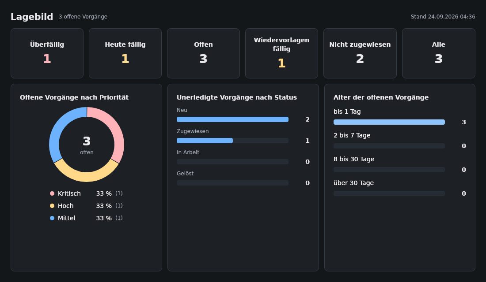
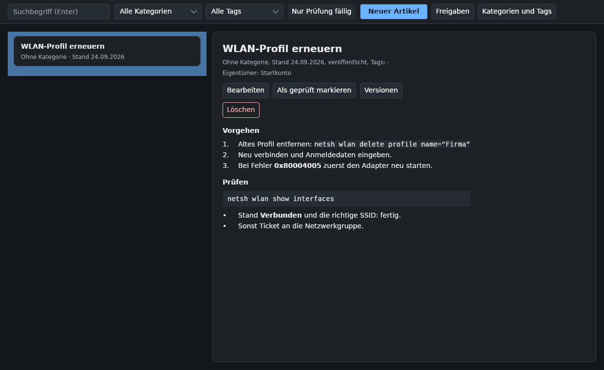
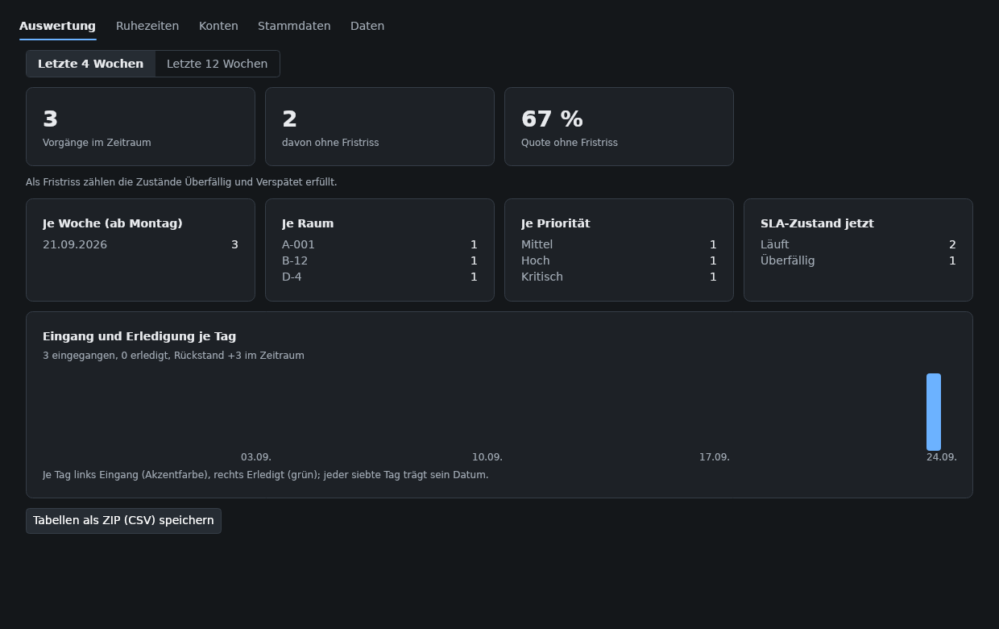

# Anleitungen für die Teamleitung

Diese Anleitungen richten sich an Personen mit der Rolle Teamleitung. Sie können alles, was ein Bearbeiter kann (siehe [Anleitungen für Bearbeiter](bearbeiter.md)), und zusätzlich: alle Vorgänge sehen und zuweisen, das Lagebild nutzen, die Wissensdatenbank pflegen, Ruhezeiten anlegen und die Auswertung lesen. Danach können Sie einen neuen Bearbeiter einarbeiten und den Weg eines Vorgangs von der Annahme bis zum Abschluss steuern.

## Vorgänge zuweisen

1. Öffnen Sie den Vorgang mit Doppelklick.
2. Wählen Sie in der Karte **Bearbeiter** in der Auswahl **Bearbeiter wählen** die Person. Die Auswahl zeigt alle Konten mit einer Mitarbeiterrolle unter ihrem Anzeigenamen; pausierte Konten lassen sich nicht zuweisen.
3. Klicken Sie auf **Zuweisen**. Die Person erscheint als Bearbeiter, ein Vorgang im Status Neu wechselt auf Zugewiesen, und die Historie hält den Wechsel fest. Die Person sieht den Vorgang ab sofort unter **Nur meine**.

### Eine Zuweisung aufheben

1. Ist jemand zugewiesen, steht in der Auswahl an erster Stelle **Niemand (Zuweisung aufheben)**. Wählen Sie diesen Eintrag; der Knopf daneben heißt jetzt **Aufheben**.
2. Klicken Sie auf **Aufheben**. Der Vorgang ist wieder für alle Bearbeiter sichtbar; die Karte zeigt keinen Bearbeiter mehr. Was das mit dem Status macht, steht in der [Referenz](referenz.md#status).

### Vorgänge pausierter Kolleginnen und Kollegen finden

Pausierte Konten behalten ihre Vorgänge. Damit nichts liegen bleibt, gibt es die Ansicht **Pausierte Zuweisungen** im Hauptfenster. Sie zeigt auch schon erledigte Vorgänge der Person; weisen Sie die offenen um. Die Pause selbst trägt die Administration im Reiter **Konten** ein (siehe [Eine Abwesenheit eintragen](administration.md#eine-abwesenheit-eintragen)); bitten Sie die Administration darum, bevor die Person in den Urlaub geht.

### Wer hat was offen

Klicken Sie in der Liste oder im Verlauf eines Vorgangs auf den Namen einer Bearbeiterin. Die Kontokarte zeigt die Zahl ihrer offenen Vorgänge; **Vorgänge dieser Person** öffnet alle ihr zugewiesenen Vorgänge, auch erledigte; die offenen erkennen Sie an der Spalte **Status**. Eine Verteilung nach Person hat das Lagebild nicht.

## Das Lagebild

Nach jeder Anmeldung öffnet sich das Fenster **Lagebild**; später erreichen Sie es über den Knopf **Lagebild** im Hauptfenster. Es beantwortet die Frage, wie es um die offenen Vorgänge steht, und frischt sich jede Minute auf.

| Bereich | Bedeutung |
|---|---|
| Kacheln **Überfällig**, **Heute fällig**, **Offen**, **Wiedervorlagen fällig**, **Nicht zugewiesen**, **Alle** | je eine Zahl; eine gefärbte Zahl drängt. Ein Klick öffnet die passende Ansicht im Hauptfenster. „Heute fällig" rechnet nach der Ortszeit und zählt die schon überfälligen nicht mit; ein Klick darauf öffnet die Ansicht **Offen** nach Lösungsfrist sortiert, überfällige stehen zuoberst. Ein noch nicht übernommener Vorgang zählt mit seiner Reaktionsfrist als heute fällig und kann in der Liste weiter unten stehen; achten Sie auf das Fristzeichen. „Nicht zugewiesen" zählt nur offene Vorgänge; die Ansicht **Unzugewiesen** zeigt auch gelöste und geschlossene ohne Bearbeiter. |
| **Offene Vorgänge nach Priorität** | Ring mit der Summe in der Mitte und einer Legende mit Anteil und Zahl je Priorität |
| **Unerledigte Vorgänge nach Status** | Balken je Status Neu, Zugewiesen, In Arbeit und Gelöst; ein Klick auf den Status öffnet dessen Liste |
| **Alter der offenen Vorgänge** | vier Stufen: bis 1 Tag, 2 bis 7 Tage, 8 bis 30 Tage, über 30 Tage. Die Stufen zählen unabhängig vom Fristzustand: Auch ein Vorgang, dessen Fristen noch laufen, kann seit Wochen liegen. |

„Offen" heißt Neu, Zugewiesen oder In Arbeit; „unerledigt" schließt Gelöst ein; „Alle" zählt jeden Vorgang des Bestands, auch geschlossene.

## Einen neuen Bearbeiter einarbeiten

1. Lassen Sie die Administration ein Konto mit der Rolle Bearbeiter anlegen und den vollen Namen setzen.
2. Geben Sie der Person den [Einstieg](einstieg.md) und begleiten Sie den ersten Vorgang. Der Einstieg dauert etwa zwanzig Minuten.
3. Weisen Sie ihr in der ersten Woche Vorgänge mit der Priorität Niedrig oder Mittel zu, damit die Fristen Luft lassen.
4. Prüfen Sie im Lagebild unter **Nicht zugewiesen** und in der Ansicht **Überfällig**, ob etwas liegen bleibt.
5. Sehen Sie sich mit der Person die Kommentare ihrer ersten Vorgänge an: Ein guter Kommentar sagt, was versucht wurde und was als Nächstes ansteht.

## Fristen steuern

### Ruhezeiten anlegen

Ferien und Betriebsruhe lassen die Fristen stillstehen: Die Fälligkeit verschiebt sich genau um die Überschneidung mit der Ruhezeit. Bereits gerissene Fristen bleiben gerissen.

1. Klicken Sie im Hauptfenster auf **Verwaltung** und wechseln Sie auf den Reiter **Ruhezeiten**.
2. Tragen Sie unter **Bezeichnung** einen Namen ein, zum Beispiel `Betriebsruhe Weihnachten`, und unter **Von** und **Bis** Tag und Uhrzeit von Beginn und Ende.
3. Klicken Sie auf **Anlegen**. Die Ruhezeit erscheint in der Liste, und die Fristen aller offenen Vorgänge werden neu berechnet.

Zum Löschen wählen Sie die Ruhezeit in der Liste und klicken auf **Gewählte löschen**; auch dann werden die Fristen neu berechnet.

### Eskalation

Das System kennt keine eigene Eskalationsstufe. Der Weg ist: Priorität erhöhen, den Vorgang einer anderen Person zuweisen und im Kommentar festhalten, warum. Ist der Mailversand eingerichtet, bekommen Teamleitung und Administration eine E-Mail, sobald an einem Vorgang erstmals eine Frist reißt; je Vorgang gibt es nur eine Meldung, ein späterer Riss der zweiten Frist wird nicht mehr gemailt. Geprüft wird alle fünf Minuten, solange das Programm läuft. Der Fristenstand unten rechts im Hauptfenster zeigt gerissene Fristen auch ohne eingerichteten Mailversand.

## Die Wissensdatenbank pflegen

Der Knopf **Wissen** öffnet die Wissensdatenbank. Als Teamleitung schreiben Sie direkt und geben die Vorschläge der Bearbeiter frei.

### Einen Artikel anlegen oder ändern

1. Klicken Sie auf **Neuer Artikel** oder wählen Sie einen Artikel und klicken Sie auf **Bearbeiten**. Der Bearbeiten-Dialog öffnet sich; rechts läuft die **Vorschau** beim Tippen mit.
2. Füllen Sie **Titel**, **Inhalt**, **Kategorie**, **Tags** und **Prüfzyklus in Tagen** aus (Vorgabe 180). Setzen Sie das Häkchen **Veröffentlicht (sonst Entwurf)**, wenn der Artikel fertig ist.
3. Klicken Sie auf **Speichern**. Der Artikel erscheint in der Liste. Jedes Speichern mit geändertem Titel, Text, Kategorie, Tags oder Veröffentlichungsstand legt eine neue Version an; der Prüfzyklus allein erzeugt keine.

Die Schreibweisen für Überschriften, Listen und Befehle stehen unter der Eingabe und in der [Referenz](referenz.md#auszeichnung-in-artikeln).

### Vorschläge freigeben

1. Klicken Sie auf **Freigaben**. Der Dialog zeigt links die offenen Vorschläge, in der Mitte den gewählten unter **Vorschlag** mit Titel, Text und der Person, die ihn eingereicht hat, und rechts unter **Bisheriger Stand** den geltenden Text zum Vergleich.
2. Klicken Sie auf **Übernehmen**, um den Vorschlag als neue Version in den Artikel zu schreiben, oder auf **Verwerfen**, wenn er nicht in die Wissensdatenbank soll; ein verworfener Vorschlag ist weg. Ein übernommener neuer Artikel ist zunächst ein Entwurf; veröffentlichen Sie ihn über **Bearbeiten**.

### Versionen ansehen und zurückgehen

1. Wählen Sie einen Artikel und klicken Sie auf **Versionen**. Der Dialog zeigt links jede Version mit Nummer, Zeitpunkt, Anlass und Person, rechts den Wortlaut.
2. Wählen Sie eine ältere Version und klicken Sie auf **Zurück auf diese Version**, dann bestätigen Sie. Titel, Text, Kategorie und Tags dieser Version werden als neue, jüngste Version gespeichert; die Geschichte bleibt vollständig. Der Veröffentlichungsstand ändert sich dabei nicht.

### Prüfung fällig

Nach Ablauf des Prüfzyklus trägt ein Artikel die Marke **Prüfung fällig**; der Umschalter **Nur Prüfung fällig** zeigt alle. Lesen Sie den Artikel. Stimmt er noch, klicken Sie auf **Als geprüft markieren**: Der Stand wird auf heute gesetzt und Sie werden Eigentümer, der Text bleibt. Stimmt er nicht mehr, bearbeiten Sie ihn.

### Kategorien und Schlagworte

1. Klicken Sie auf **Kategorien und Tags**. Der Dialog zeigt links die Kategorien, rechts die Schlagworte (Tags).
2. Tragen Sie einen Namen ein und klicken Sie auf **Anlegen**, oder wählen Sie einen Eintrag und klicken Sie auf **Umbenennen** oder **Löschen**. Artikel behalten beim Umbenennen ihre Zuordnung. Eine Kategorie oder ein Tag mit Artikeln lässt sich nicht löschen; die Meldung nennt die Zahl. Hängen Sie die Artikel vorher um.

### Einen Artikel löschen

Wählen Sie den Artikel und klicken Sie auf **Löschen**, dann bestätigen Sie. Der Artikel verschwindet samt seinen Versionen und offenen Vorschlägen. Anders als Vorgänge sind Artikel lebende Dokumentation, keine Akten.

## Die Auswertung lesen

1. Klicken Sie auf **Verwaltung**. Das Fenster öffnet sich auf dem Reiter, den Sie zuletzt offen hatten; **Auswertung** ist der erste Reiter.

   
2. Wählen Sie **Letzte 4 Wochen** oder **Letzte 12 Wochen**. Kennzahlen und Tabellen zeigen den gewählten Zeitraum.

| Anzeige | Bedeutung |
|---|---|
| **Vorgänge im Zeitraum**, **davon ohne Fristriss**, **Quote ohne Fristriss** | die drei Kennzahlen. Im Zeitraum liegt jeder Vorgang, der in den letzten 4 oder 12 Wochen angelegt wurde, auch offene und geschlossene. „Ohne Fristriss" heißt: bis jetzt keine Frist gerissen; ein noch laufender Vorgang zählt dazu, ebenso ein ohne Lösung geschlossener, denn seine noch offenen Fristen entfallen, auch eine schon überfällige Lösungsfrist. Nur wer einen Vorgang aus Neu erst nach Ablauf der Reaktionsfrist schließt, erzeugt damit einen Fristriss (siehe [Status](referenz.md#status)). Ein überfälliger Vorgang, der ohne Lösung geschlossen wird, verbessert also die Quote; schließen Sie deshalb nur, was wirklich nicht mehr bearbeitet wird. Die Quote ist deshalb erst belastbar, wenn die längste Frist (in der Vorgabe 72 Stunden) für alle Vorgänge des Zeitraums abgelaufen ist. |
| **Je Woche (ab Montag)**, **Je Raum**, **Je Priorität**, **SLA-Zustand jetzt** | Verteilungen der Vorgänge des Zeitraums |
| **Eingang und Erledigung je Tag** | zwei Säulen je Tag; erledigt ist ein Vorgang an dem Tag, an dem er auf Gelöst gesetzt wurde, auch wenn er älter als der Zeitraum ist. Liegt der Eingang über der Erledigung, wächst der Rückstand. Tage und Wochen beginnen um 0:00 UTC (Weltzeit, also 1:00 oder 2:00 Uhr deutscher Zeit). |

**Tabellen als ZIP (CSV) speichern** schreibt alle Tabellen des Bestands als CSV-Dateien für die Tabellenkalkulation; die Datei `LIESMICH.txt` im Archiv erklärt die Schreibweise der Felder.
